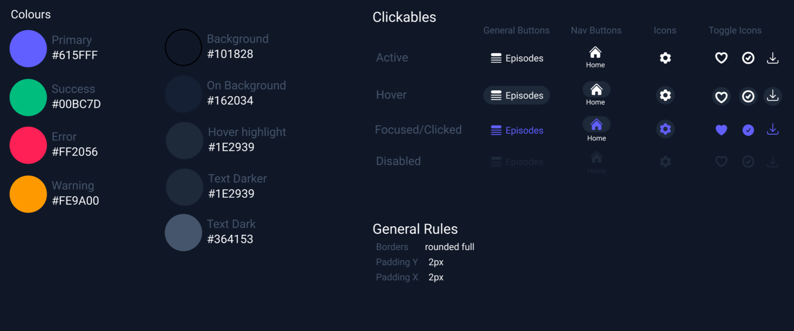

# Bluebottle Design Doc

Bluebottle was generally built in very traditional steps, rather than experimenting by writing code.

Part of the reason for this (other than it being the "correct" way of doing UI), is in Rust, 
hot reloading is very difficult so quickly editing things can become painful.

## Core - Styling

> One of the most important parts of the UI is the colour theme and design language. This is generally inspired
> by Material UI, partially because I originally started building this UI in Flutter until I decided I hated writing Dart.

The UI itself tries to avoid using elevation for buttons and other inputs. Instead, we use elevation for the
sub-menues/modals. 

Borders must always be fully rounded, making most things pilled shape while we add relatively minimal padding.

## Bluebottle wireframes

